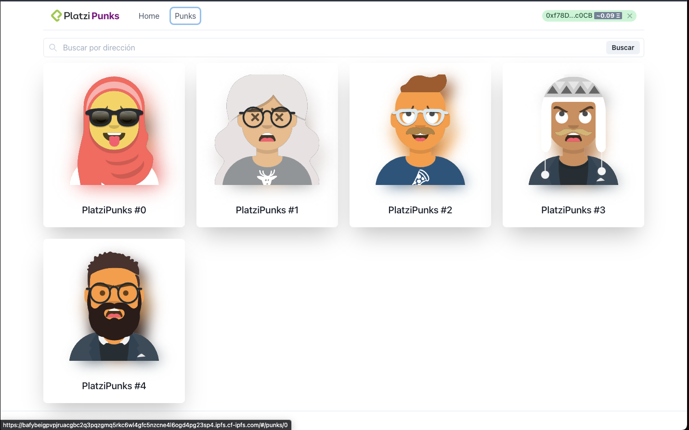

# Platzi Punks Interface 👋

<p align="center">
<a href="https://bafybeigpvpjruacgbc2q3pqzgmq5rkc6wl4gfc5nzcne4l6ogd4pg23sp4.ipfs.cf-ipfs.com/#/">

</a>
<br><br>
     Platzi Punks NFT MarketPlace
    <br><br>
  <a href="https://www.npmjs.com/package/react">
    
  </a>
  <a href="#">
    
  </a>
  <br>
    <br>
    <a href="https://github.com/brenfondeadora/platzi-punks-interface/issues/new">Report bug</a>
    ·
    <a href="https://github.com/brenfondeadora/platzi-punks-interface/issues/new">Request feature</a>
</p>

## 💻 Run Locally

**Step 1:**

Install dependencies `yarn install`

**Step 2:**

Run the app on localhost with `yarn start`

**Step 3:**

Open [http://localhost:3000](http://localhost:3000) to view it in your browser.

**Step 4:**

To create build files `yarn build`

<br>

## 🤳 Requirements

* [Metamask](https://metamask.io/)
* [testnet LINK](https://faucets.chain.link/rinkeby)

<br>

## 🚀 Upload file to IPFS

**Step 1:**
Create Hash to upload to IPFS `sh ./deploy.sh` <br>

**Step 2:**
Copy hash created 
```
{"Name":"","Hash":"bafybeigpvpjruacgbc2q3pqzgmq5rkc6wl4gfc5nzcne4l6ogd4pg23sp4","Size":"10214721"}
* Closing connection 0
* TLSv1.2 (IN), TLS alert, close notify (256):
* TLSv1.2 (OUT), TLS alert, close notify (256):
```

**Step 3:**
Use any url of the [public gateway](https://ipfs.github.io/public-gateway-checker/) and copy the hash and put in in the beggining to test

[https://bafybeigpvpjruacgbc2q3pqzgmq5rkc6wl4gfc5nzcne4l6ogd4pg23sp4.ipfs.dweb.link/#/]
[https://bafybeigpvpjruacgbc2q3pqzgmq5rkc6wl4gfc5nzcne4l6ogd4pg23sp4.ipfs.cf-ipfs.com/#/]

<br>

## ✨ TODO

- [ ] Tests
- [ ] Design Changes
- [ ] Link to OpenSea

<br>

## 👤 Author

**Brenda Saavedra**

- Twitter: [@brsaca](https://twitter.com/brsaca)
- Github: [@brenfondeadora](https://github.com/brenfondeadora/)

<br>

## 📝 License

Copyright © 2022 [Brenda Saavedra](https://github.com/brenfondeadora).<br />
This project is [MIT License]() (MIT)